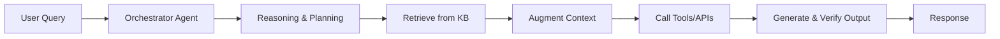

# Agentic RAG

## Overview
**Agentic Retrieval-Augmented Generation (Agentic RAG)** is the next evolution of RAG systems.  
It enhances the standard RAG architecture by giving AI agents **autonomy** to plan, execute, and adapt multi-step tasks—rather than simply retrieving and summarizing content.

While **naïve RAG** focuses on a single retrieve-then-generate loop, Agentic RAG introduces:
- **Reasoning Loops**: Multi-step query refinement, decomposition, and context building.
- **Tool Use**: Agents can call APIs, run computations, or interact with external systems.
- **Workflow Orchestration**: Chaining multiple agents or tools to achieve complex goals.

---

## Why Agentic RAG?
Traditional RAG solves **"Where’s the answer?"**  
Agentic RAG solves **"How do I get the answer, verify it, and use it?"**

### Key Benefits
- **Higher Accuracy**: Iterative reasoning and retrieval.
- **Autonomy**: Less manual prompting for multi-step queries.
- **Integration**: Direct connection to enterprise tools, data, and workflows.
- **Scalability**: Multi-agent orchestration for larger tasks.

---

## Architecture

---

## Example Use Case
**Industrial Printing Troubleshooting**
1. User describes a print defect.
2. Agent breaks down the request into *diagnostic*, *historical search*, and *repair* steps.
3. Retrieves logs, manuals, and prior cases.
4. Calls device APIs for live status.
5. Generates a guided resolution with references.

---

## Roadmap
- **Phase 1** – Convert Naïve RAG queries into multi-step workflows.
- **Phase 2** – Add tool/plugin registry for external actions.
- **Phase 3** – Enable autonomous task execution with approval gates.
- **Phase 4** – Multi-agent mesh with shared memory and continuous learning.

---

## References
- [Microsoft: Agentic Retrieval](https://learn.microsoft.com/en-us/azure/search/search-agentic-retrieval-concept)
- [OpenAI: Tool Use and Agents](https://platform.openai.com/docs/assistants/tools)
- Engelbart’s *Mother of All Demos* (1968) – Inspiration for multi-modal, integrated workflows.
- Xerox PARC GUI Revolution – Making complex systems accessible.
